# HB - Dotfiles / Configs
This is a repo containing all of my own customizations, personalizations and configurations, These are completely based on my own preferences and beware while applying it to your systems as it may lead to some issues or dissatisfaction, But feel free to use it and customize it as per your own needs. 
This repo is maintained for a soul reason of storing my configs so that when I change my machine or distros I can get back my personalizations.

## Homescreen and terminal with "neofetch" (custom logo).
- Customized Dracula / Nordic icons
- CUstomized Top bar with gnome extensions

## Terminal zsh, customized starship prompt with oh-my-zsh plugins.
- Starship: custom catpuccin pallete config
- plugins: syntax_highlighting, autosuggestion

## Neovim customization using NVchad with Catpuccin color theme.

## Custom commands / aliases.

## Dracula / Colloid Purple theme and Gnome Extensions.

## VS Code Custom theme (OM Theme (no italic)).

## Purple-Land (My Custom Hyperland in GNOME)
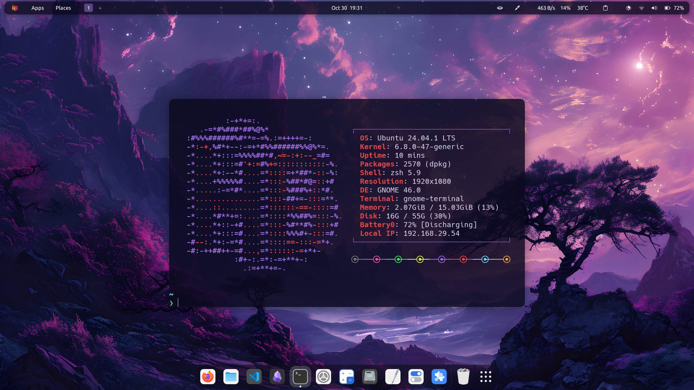
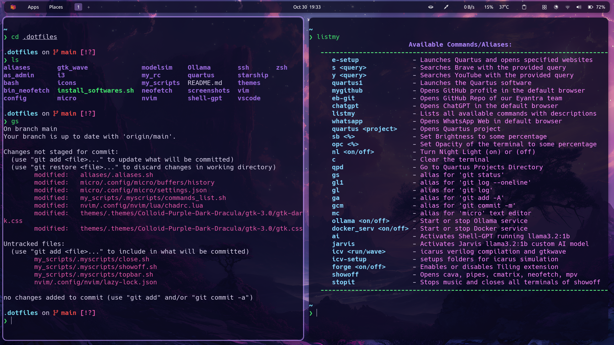
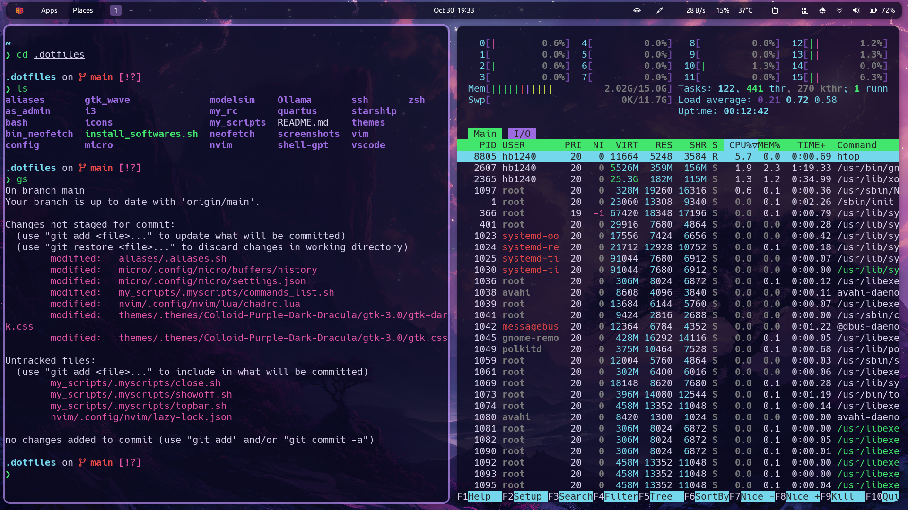
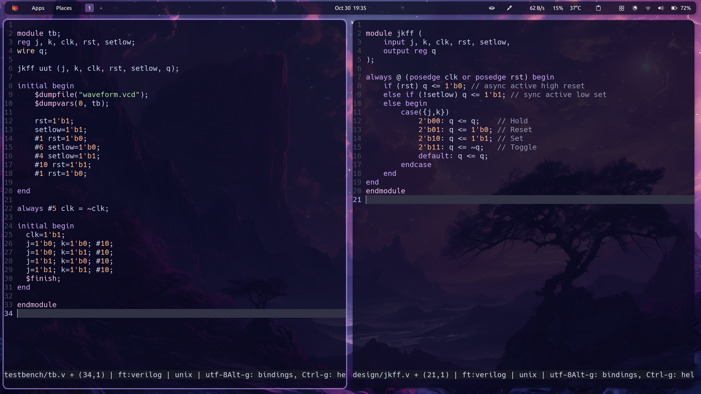
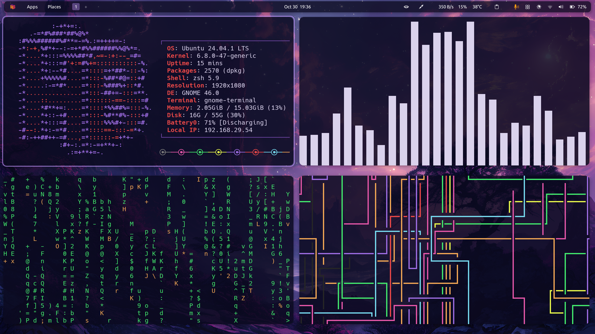

## Hyprland on Ubuntu (Official)
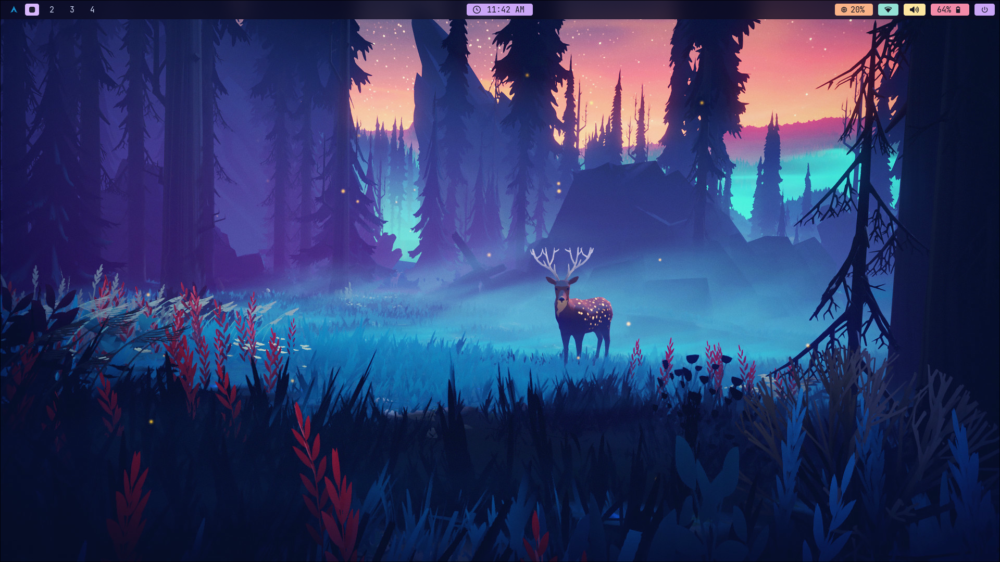
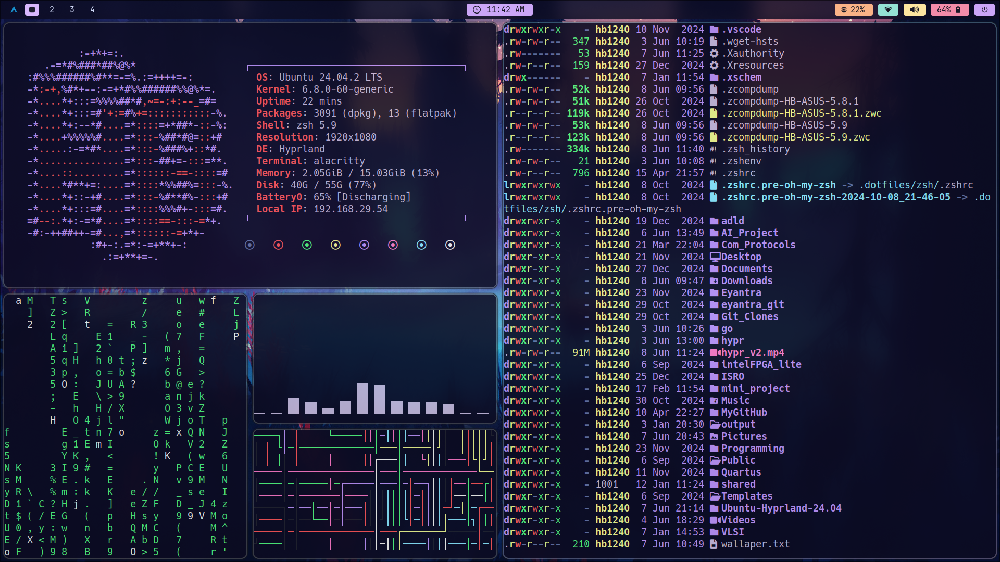
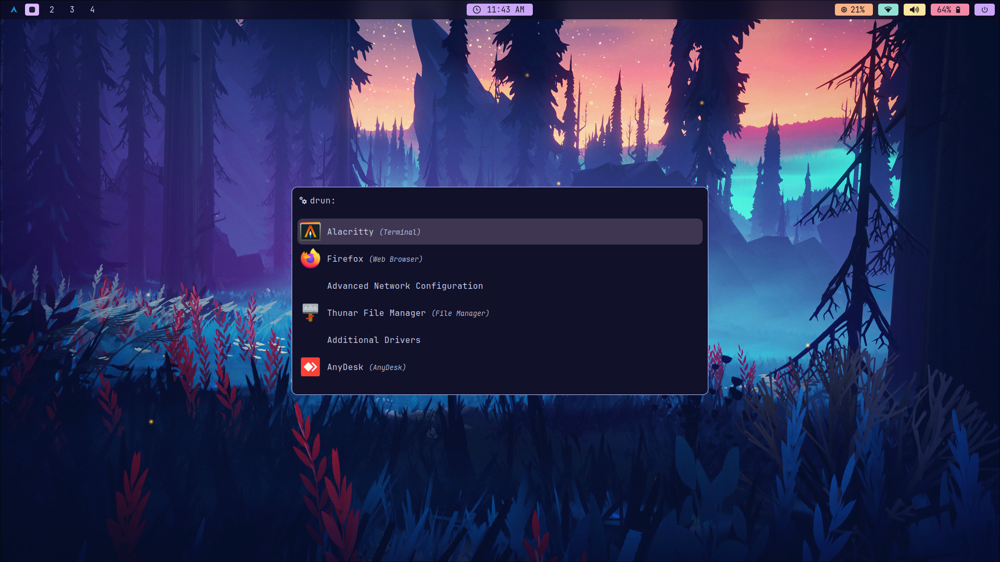
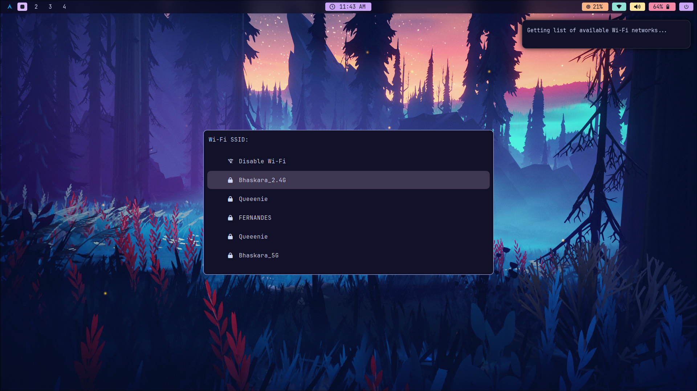
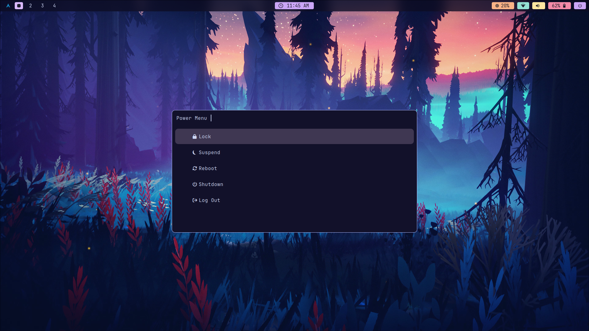
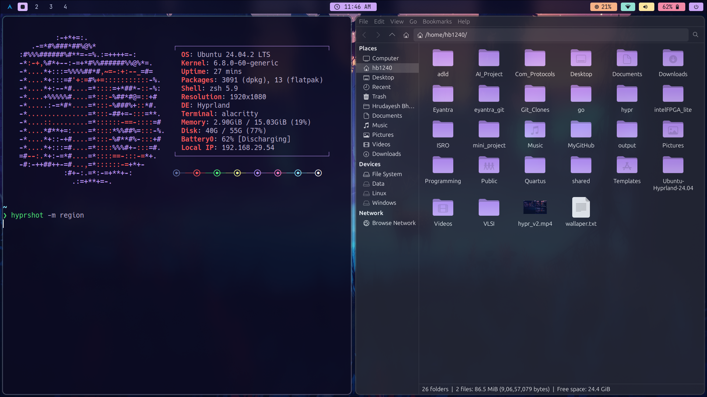
